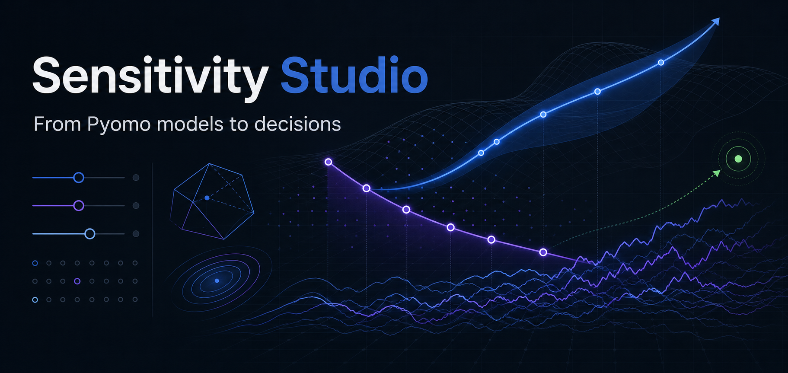
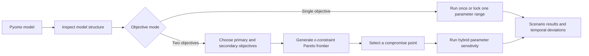
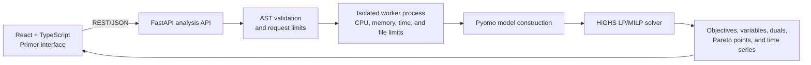

# Sensitivity Studio



<p align="center">
  An interactive decision workbench for real Pyomo + HiGHS optimization.<br />
  Explore parameters, trade-offs, scenarios, and temporal deviations without leaving the model behind.
</p>

<p align="center">
  
  
  
  
</p>

## Live Demo

[Open Sensitivity Studio](https://sensitivity-studio2.pages.dev/)

## Motivation

An optimization model rarely ends with one optimal number. Analysts still need to understand what changes when demand moves, capacity tightens, costs rise, objectives conflict, or decisions evolve over time.

That work is often fragmented across scripts, spreadsheets, solver logs, and manually prepared charts. Sensitivity Studio turns it into one guided workflow: submit a Pyomo model, discover its analytical structure, solve it, and move from mathematical output to a defensible decision story.

The application is designed for operations-research students, researchers, and analysts who need to answer questions such as:

- Which assumptions have the greatest effect on the optimum?
- Which scenario produces the best result, and what is its deviation from the baseline?
- What is sacrificed when two objectives compete?
- Does a selected compromise remain stable across a parameter range?
- Where do time-indexed decisions diverge from the base model?

## What it delivers

| Capability | What the analyst can do |
| --- | --- |
| Model inspection | Paste or load a Pyomo model and discover mutable scalar and indexed parameters, objectives, directions, and time-indexed outputs. |
| Single solve | Change multiple parameter values and solve the current model once. |
| Sensitivity sweep | Lock one parameter with an exact start, end, and step; compare every solved scenario with the baseline. |
| Solution evidence | Inspect objective value, solve status, runtime, variables, constraints, and LP duals. |
| Bi-objective analysis | Choose two discovered objectives and generate a 10-point ε-constraint Pareto frontier. |
| Hybrid sensitivity | Select a Pareto compromise and recalculate that normalized preference across a parameter sweep. |
| Temporal analysis | Compare the baseline, selected scenario, and solved-scenario envelope by period using values, Δ, or Δ%. |
| Guided exploration | Select scenarios directly from charts or tables and move backward through the analysis without losing context. |

## Decision journey



Single-objective analysis remains the direct path for ordinary LP and MILP models. The Pareto workflow is an additional path that appears when the model exposes two objectives.

## Optimization design

### Single run and parameter sweep

A single run applies the current parameter values and returns the genuine HiGHS result. A sweep varies exactly one mutable parameter while keeping the rest fixed. Start, end, and step are explicit so the experiment is reproducible and physically meaningful.

Each scenario is solved independently. Optimal, infeasible, and unbounded outcomes remain solver outcomes rather than fabricated frontend data.

### Pareto frontier with ε-constraint

For a bi-objective model, the user chooses a primary and secondary objective from the components discovered in the model. The primary objective is optimized directly while progressively tighter bounds are placed on the secondary objective.

This ε-constraint approach was selected because it:

- respects each objective's minimize or maximize direction;
- produces interpretable trade-off candidates;
- works with linear and mixed-integer models supported by HiGHS;
- does not replace the original single-objective workflow.

The current frontier uses 10 preference positions. Clicking a point selects the corresponding solved scenario and exposes its variables, constraints, status, and runtime.

### Hybrid sensitivity

A Pareto point represents a decision preference, not just a coordinate. Hybrid sensitivity preserves that point's normalized ε position while a selected model parameter changes. Both objectives are re-solved at every scenario, showing whether the chosen compromise is robust or fragile.

### Time-series comparison

When outputs are indexed by sets such as `PERIODS`, `YEARS`, `STAGES`, or `HOURS`, the result page can show:

- the base-model trajectory;
- the currently selected scenario;
- an envelope bounded by the minimum and maximum solved scenario value at each period;
- exact indexed trajectories or `Sum`/`Mean` aggregation across other dimensions;
- absolute values, delta from baseline, or percentage delta.

Only scenarios with available solved values contribute to the envelope. Missing values remain visible through coverage information rather than being silently replaced.

## Starter model library

The opening workspace includes five real models that use the same backend and solver path as pasted code.

| Model | Type | Demonstrates |
| --- | --- | --- |
| Production portfolio | LP | Resource allocation, dual values, and a scalar sensitivity sweep |
| Factory planning | MILP | Binary setup decisions, inventory, overtime, and indexed time-series output |
| Facility location network | MILP | Facility binaries, capacitated network flow, and demand sensitivity |
| Supply chain: cost vs carbon | Bi-objective | Pareto trade-offs, hybrid sensitivity, and temporal production decisions |
| Energy transition planning | Bi-objective | Investment planning, dispatch, cost-emissions trade-offs, and time series |

Additional model files are available in [`examples/`](examples/).

## Model contract

Models must expose a `ConcreteModel` through the variable name `model`. Sensitivity inputs must be numeric Pyomo parameters declared with `mutable=True`.

```python
from pyomo.environ import ConcreteModel, Objective, Param, Var, maximize

model = ConcreteModel()
model.capacity = Param(initialize=100, mutable=True)
model.production = Var(bounds=(0, model.capacity))
model.profit = Objective(expr=24 * model.production, sense=maximize)
```

Supported today:

- linear programming and mixed-integer linear programming;
- continuous, integer, and binary variables;
- scalar and indexed mutable numeric parameters;
- one active objective or two discoverable objective components;
- time-indexed variables and expressions;
- LP duals when the model imports a Pyomo dual suffix.

Not currently supported:

- general nonlinear or power expressions;
- external solver callbacks or arbitrary imports;
- indexed objective containers;
- more than two objectives in one Pareto analysis;
- simultaneous sweeping of multiple parameters.

## Technical architecture



| Layer | Technology and responsibility |
| --- | --- |
| Interface | React, TypeScript, Vite, Primer React, and Recharts provide the editor, guided workflow, data tables, and interactive charts. |
| API | FastAPI validates requests and coordinates inspection, solving, sensitivity, Pareto, and hybrid-sensitivity operations. |
| Optimization | Pyomo represents each submitted model; HiGHS performs the real LP/MILP solves. |
| Execution boundary | Each operation runs in a separate non-root worker with syntax restrictions and CPU, memory, wall-time, file-size, and file-descriptor limits. |
| Deployment | Cloudflare Pages serves the frontend; Railway builds and runs the Dockerized backend. |

## Local development

### Backend

```powershell
cd backend
python -m venv .venv
.\.venv\Scripts\python.exe -m pip install -r requirements.txt
.\.venv\Scripts\python.exe -m uvicorn main:app --reload
```

The API is available at `http://localhost:8000`; verify it at `http://localhost:8000/health`.

### Frontend

```powershell
cd frontend
npm install
npm run dev
```

Open `http://localhost:5173`. The frontend defaults to the local API; override it with `VITE_API_BASE_URL` when needed.

## Deployment

### Railway backend

1. Create a Railway service from the GitHub repository.
2. Set its root directory to `backend` and deploy with `backend/Dockerfile`.
3. Configure:

   ```text
   ALLOWED_ORIGINS=https://YOUR-PROJECT.pages.dev
   SANDBOX_TIMEOUT_SECONDS=60
   SANDBOX_CPU_SECONDS=45
   SANDBOX_MEMORY_MB=384
   SANDBOX_MAX_CONCURRENT=1
   ```

4. Generate a public domain and verify `https://YOUR-API.up.railway.app/health`.

### Cloudflare Pages frontend

| Setting | Value |
| --- | --- |
| Root directory | `frontend` |
| Build command | `npm run build` |
| Build output directory | `dist` |
| Environment variable | `VITE_API_BASE_URL=https://YOUR-API.up.railway.app` |

After Cloudflare assigns the production origin, set that exact origin as Railway's `ALLOWED_ORIGINS` value and redeploy the backend. Do not use `*` for the public solver API.

## Security boundary

Submitted code does not execute inside the FastAPI process. The application validates its syntax and runs each operation in a constrained child process with a `pyomo.environ`-only import policy, bounded request size, one concurrent job by default, a wall-clock timeout, and Linux resource limits.

This is application-level hardening, not a VM-grade security boundary. Before allowing unrestricted anonymous traffic at scale, add authentication, edge rate limiting, monitoring, quotas, and dedicated microVM or container isolation—or replace Python input with a declarative model format.

## Project status

Version 2.1 provides the complete single-objective, bi-objective, hybrid-sensitivity, and temporal-comparison workflows described above. The application is suited to coursework, research demonstrations, portfolio evaluation, and controlled low-traffic analysis environments.
